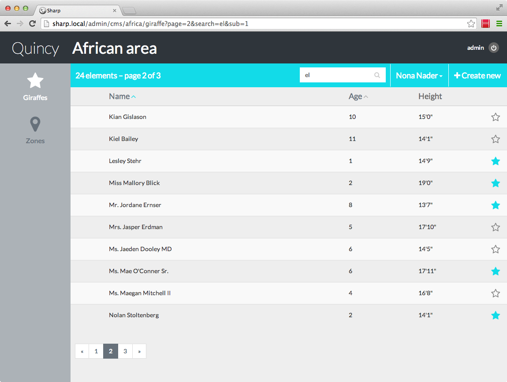
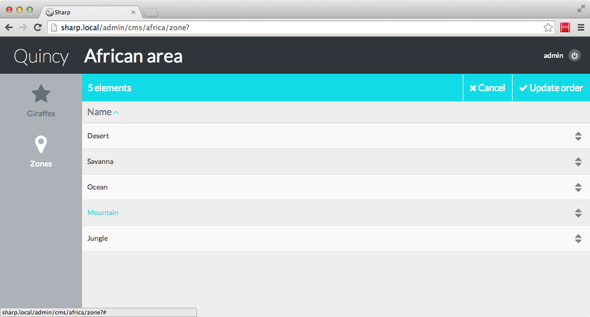
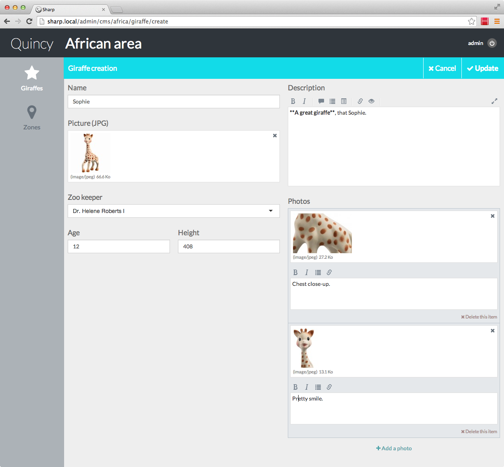
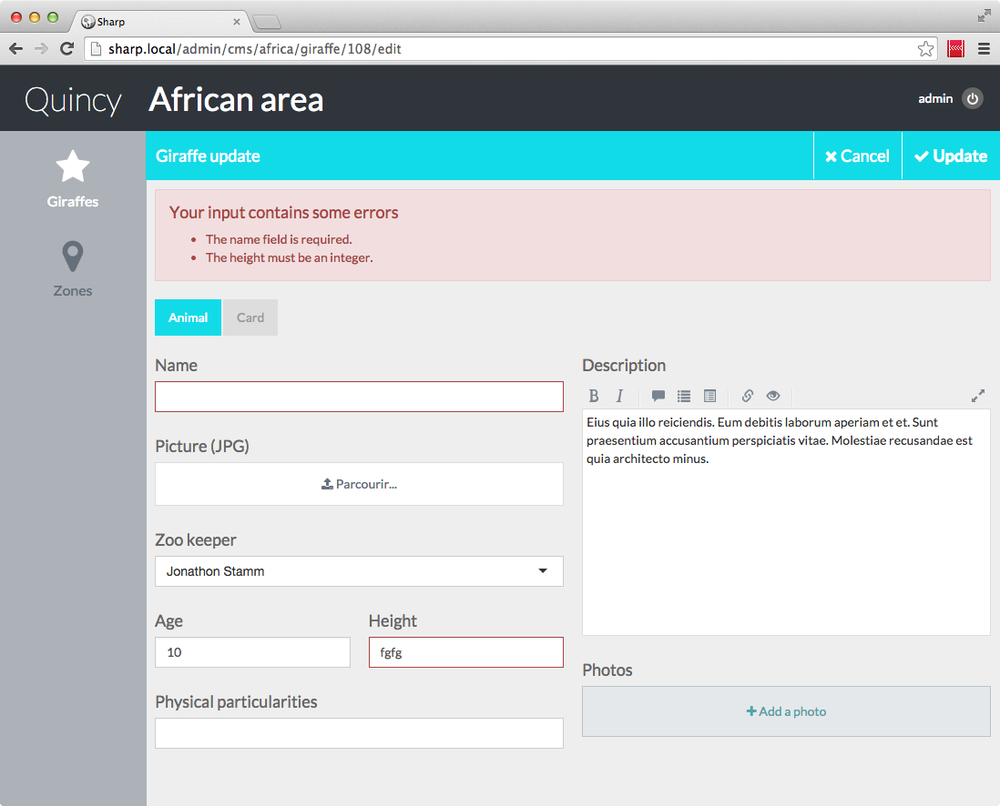

#Sharp

*A Laravel CMS for developers who hate CMS*

Sharp is a Laravel CMS package which intent to greatly simplify data management of a website *without* implicating a special data storage or organization, being as much as possible data-agnostic. 

Well, I think I can try to be clearer: in many of my web projects there's a lot of business data to manage, and my clients need some tool to handle those texts, images, lists, links and other stuff. I can either develop each time a dedicated admin panel (hmm... no), or integrate a full CMS, in which case I often have to adapt my data storage technology and database schema to the CMS tool (or sometimes worse, the tool manages itself my data structure). Sharp is an decent attempt to keep the CMS cool part (data inputs including uploads, lists, ..., validation, auth, ...) without the crap (Sharp doesn't know about my database nor about the way I want to organize my code).

*Note: this documentation is written as a tutorial: it's best to read it from the beginning to the end, because we are going to build a small example together. But if you are an adventurer, no problem: I think each part is readable alone also.*

*And another note: english is not my first language. Well, you'll have to deal with it.*

---

##Installation

- Through composer, add `"dvlpp/sharp": "~1.0"` in your require section, and run `composer update`.
- Next add `'Dvlpp\Sharp\SharpServiceProvider'` in your app.php providers section.
- And finally, run those two commands:
	- `php artisan config:publish dvlpp/sharp` to publish the two necessary config file (see below)
	- `php artisan asset:publish dvlpp/sharp` to publish JS and CSS used by Sharp

OK, you're good to go. One final note: after an composer update, always re-run the asset publish command to be sure to have the current assets version.

1. [Concepts](docs/concepts.md)

2. [The config file(s)](docs/config.md)

1. [Repository and data management](docs/repository.md)

3. [Entities lists](docs/entities_list.md) (renderers, sorting, activation, reordering, pagination, search, ...)

4. [Entity forms](docs/entity_form.md) (fields, validation, update, ...)

5. [Sharp Eloquent Auto-updater](docs/auto-updater.md)

6. [Authentication](docs/authentication.md) (global auth and rights management)

7. [Commands](docs/commands.md)

---

## Quick overview in screenshots

*Sharp provides a simple way to handle entities lists with ordering, pagination, search, state indicator, column data rendering and more*

*Entities lists can easily be re-arrange*

*Sharp generated forms can include file uploads, dynamic lists and many more other field types*

*Form Validation is mostly automatic and easy*