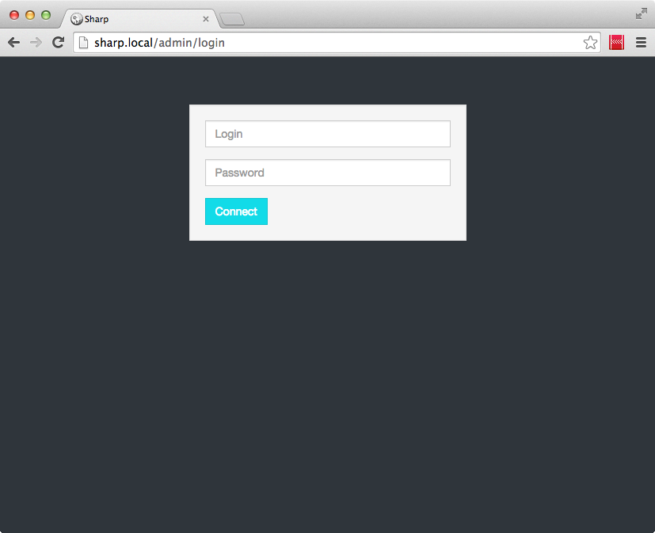
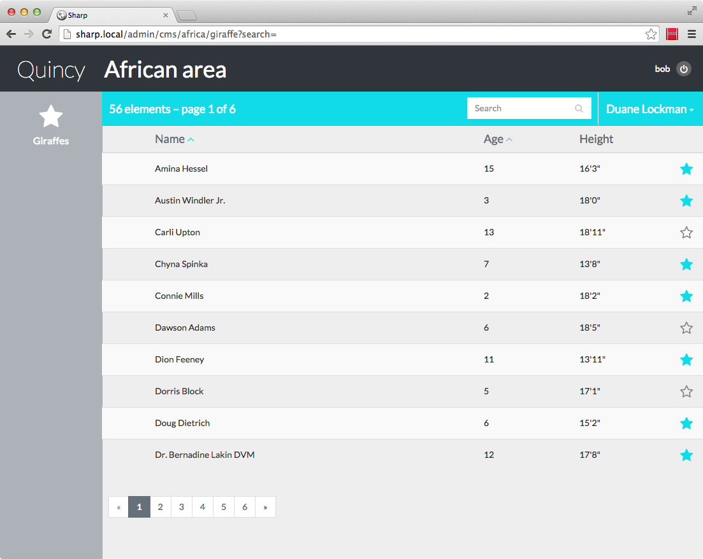

#Authentication and rights management

Sharp shall not be responsible of the auth or access rights management of a particular application: implementation is your choice.

1. [Config](#config)
2. [Auth service](#auth)
3. [Rights management](#rights)


##<a name="config"></a>  1. Config

To enable authentication, we simply indicate a Auth service class in the application config (`site.php`):

```
<?php

return [
	"name" => "Quincy",
	"auth_service" => '\Quincy\Sharp\SharpAuthentication'
];
```


##<a name="auth"></a>  2. Auth service

Then, we have to write this `Quincy\Sharp\SharpAuthentication` class, making it implements  `Dvlpp\Sharp\Auth\SharpAuth`:

```
<?php namespace Quincy\Sharp;

use Dvlpp\Sharp\Auth\SharpAuth;
use Auth;

class SharpAuthentication implements SharpAuth {

	 function checkAdmin()
	 {
		return Auth::user();
	 }

	 function login($login, $password)
	 {
		if (Auth::attempt(array('login' => $login, 'password' => $password)))
		{
			return Auth::user()->login;
		}
		return false;
	 }

	 function logout()
	 {
		Auth::logout();
	 }

	 function checkAccess($login, $type, $action, $key)
	 {
		return true;
	 }
}
```

We have 4 methods to implement:

- `checkAdmin()` must return a boolean is the current authenticated user has Sharp rights, meaning that he can login to Sharp.
- `login()` is responsible of check credentials and return either the logged user name, or false in case of failure
- `logout()` is obvious
- and finally, `checkAccess()` if specific to rights management, detailed below.

In this example, I wrote the class in maybe the simplest way. Of course, you could have a much more complex implementation, and it doesn't really matters: Sharp only need to know how to login a user, and if a user is logged in.

Once the class is written, we can test it by hitting any Sharp page, and we get a login form:



Notice also that a logout link appears in Sharp's header.


##<a name="rights"></a>  3. Rights management

Question is now: how to authorize specific users for specific actions? Suppose we want to set our rights this way:

- Zones can only be viewed by the user "admin"
- Giraffes can be viewed and updated by any authenticated user, but creation and deletion are reserved to "admin"

Well, this is how we can code it:

```
function checkAccess($login, $type, $action, $key)
{
	$user = \User::where("login", $login)->first();

	if($user)
	{
		if($key == "zone")
		{
			return $user->login == "admin";
		}

		elseif($key == "giraffe")
		{
			switch($action)
			{
				case "delete":
				case "create":
					return $user->login == "admin";
			}
		}

		return true;
	}

	return false;
}
```

Code is pretty clear. Let's just review the method parameters:

- `$login` is the user login to test: in fact, Sharp will pass the values returned by the `login()` method.
- `$type` is either "entity" or "category".
- `$action` can be:
	- view (category only): ability to browse a category and its entities
	- list (entity only): ability to view and entity list
	- update (entity only): ability to update an entity instance (and to view its form)
	- create (entity only): ability to create an entity instance
	- delete (entity only): ability to delete an entity instance (requires update right)
- `$key` is the category or the entity key ("africa", or "giraffe").

With the implementation written above, here's how a user named "bob" would see Sharp (no zone category, no create button):



One final note: you can of course manage users and rights in Sharp itself, creating the corresponding entities.