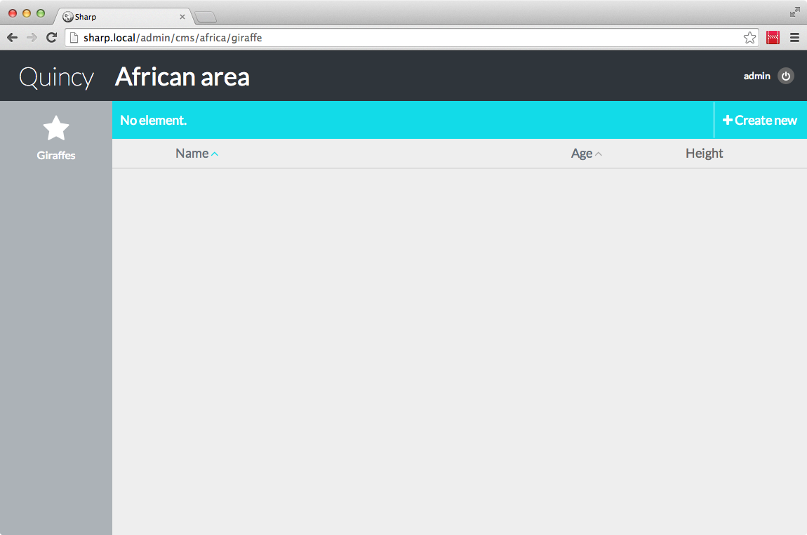
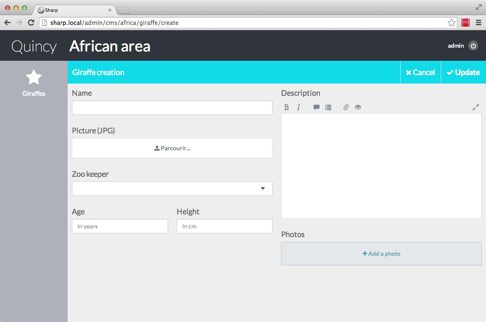

# Sharp's config file(s)

Sharp development is divided in two parts: the coding (by extending / implementing Sharp's classes or interfaces), and the data description, done in config files. Sharp has two of them:

- a *site* config, quite simple
- and a *cms* one, quite complicated.

## The site config file
Here's a simple example, of a file stored in `app/config/packages/dvlpp/sharp/site.php`:

```
   return [
      "name" => "Quincy",
//      "auth_service" => '\Quincy\Services\SharpAuth'
   ];
```

OK, that's all of it for now. Oh, and that's the long-version: auth_service isn't even required (and we'll see how it works later, this is why it's commented for now). So, basically, in this file you give a name to your project. Be creative.

## The cms config file
The purpose of this file is to describe, for each *Entity*, the form fields, the list columns, and some options. Let's see an example for our giraffe in a zoo:

```
return [

"africa" => [
	"label" => "African area",
	
	"entities" => [
		"giraffe" => [
			"label"   => "Giraffe",
			"icon"    => "star",
			"plural"  => "Giraffes",
			
			"id_attribute" => "id",

			"active_state_field" => "alive",

			// List columns
			"list_template" => [
				"columns" => [
					"picture" => [
						"width" => 1,
						"renderer" => 'thumbnail:100x100'
					],
					"name" => [
						"header"   => "Name",
						"sortable" => true,
						"width" => 7
					],
					"age" => [
						"header"   => "Age",
						"sortable" => true,
						"width" => 2
					],
					"height" => [
						"header"   => "Height",
						"width" => 2
					]
				],

				"paginate" => false,
				"reorderable" => false,
				"sublist" => false,
				"searchable" => false
			],

			// Model
			"repository" => '\Quincy\Sharp\Giraffe\Repository',
			"validator" => '\Quincy\Sharp\Giraffe\Validator',

			// Fields
			"form_fields" => [
				"name" => [
					"label" => "Name",
					"type" => "text"
				],

				"picture" => [
					"label" => "Picture (JPG)",
					"type" => "file",
					"file_filter" => "jpg,jpeg",
					"file_filter_alert" => "JPG only",
					"thumbnail" => "200x100"
				],

				"zoo_id" => [
					"label" => "Zoo",
					"type" => "ref",
					"repository" => '\Quincy\Sharp\Zoo\Repository'
				],

				"desc" => [
					"label" => "Description",
					"type" => "markdown",
					"toolbar" => "BI QU LP F"
				],
				
				"age" => [
					"label" => "Age",
					"type" => "text",
					"attributes" => [
						"placeholder" => "In years"
					],
					"field_width" => 6
				],
				
				"height" => [
					"label" => "Height",
					"type" => "text",
					"attributes" => [
						"placeholder" => "In cm"
					],
					"field_width" => 6
				],

				"photos" => [
					"label" => "Photos",
					"type" => "list",
					"sortable" => true,
					"addable" => true,
					"removable" => true,
					"add_button_text" => "Add a photo",
					"item" => [
						"file" => [
							"type" => "file",
							"file_type" => "jpg,jpeg,png,gif",
							"thumbnail" => "0x100"
						],
						"legend" => [
							"type" => "markdown",
							"height" => 120,
							"toolbar" => "BIUL"
						]
					]
				]
			], // End of form fields
			
			"form_layout" => [
				"tab1" => [
					"tab" => "",
					"col1" => [
						"name",
						"picture",
						"zoo_id",
						"age",
						"height"
					],
					"col2" => [
						"desc",
						"photos"
					]
				]
			]
		]
	]
]       

```

OK. This is a lot, but the idea is to describe all the more or less static business logic. So, let's first see what's Sharp doing with this config file. We can do it by opening the browser to the address `domain.com/admin/cms/africa/giraffe`. And:



Clicking "Create new":



So what's happened? Well, with some config and a little amount of code (OK, I cheated, this won't work with just the config file, but we'll get to that), we got a simple tool to enter our data. But let's start by explaining this config file, part by part.

### Category
First, at the top, we start with a *category* defined with a key (`africa`) and a label (`African area`). The only purpose of categories is to group entities: basically, it's all about present an "African area" menu.

### Entity presentation : label, icon, plural
The *entity* also has a key (`giraffe`) and a label, and two other presentation attributes: a plural name and an icon. For now, icons are picked in the [Font Awesome 4 icons base](http://fontawesome.io/icons/).

### Instance id: id_attribute
This is also an optional attribute, because "id" is the default. This attribute must be added if you model identifier attribute is something else — Sharp will use this in some parts (fields creation or auto-updater).

### Entity state field: active_state_field
This optional attribute is useful when you need a online/offline switch, which is common is CMS cases. It's really basic: if you specify an value here, let's say `alive` like in this example, Sharp will check for an alive boolean attribute on each giraffe instance, and will display on each row an indicator button which permits to toggle the state. We will talk about this in the Entities list section of this documentation.

### Entities list: list_template
Here is the place to define how you data (giraffes) are displayed in the list: what columns and how, can we sort them, paginate them, can we perform a search, ... This is the main topic of the "Entities list" chapter.

### Entity model: repository and validator
Defining a *repository* is mandatory, while *validator* is optional. Well, as you can imagine, it's all about handle the data: getting from DB, and updating it. We'll get to that in the very next chapter.

### Entity form: form_fields and form_layout
Finally, what are the actual fields the user can fill, and how are they displayed? "Entity forms" chapter will explain this.


## Config file split

The CMS file can be really huge, because each entity has a lot of attributes. On solution to keep the file readable is to split it, by specifying an external config file name. For instance, main cms config might look like this:

```
return [
	"africa" => [
		"label" => "African area",
	
		"entities" => [
			"giraffe" => "sharp_africa_giraffe",
			"lion" => "sharp_africa_lion"
		]
	]
]
```

And then, under `/app/config` you need to create two config files : `sharp_africa_giraffe.php` and `sharp_africa_lion.php`, with the content of the entity config.