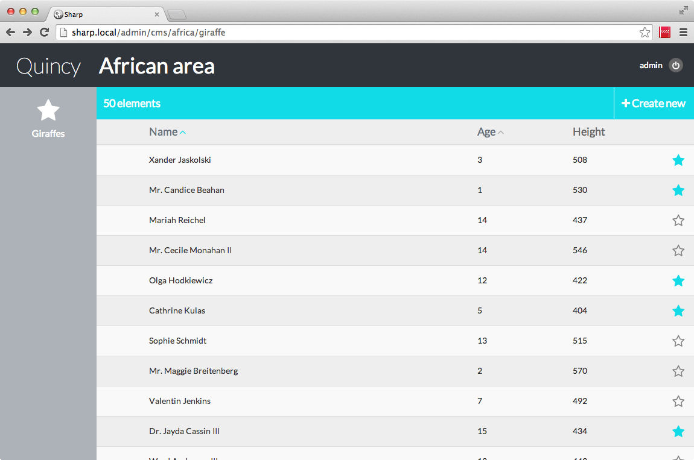
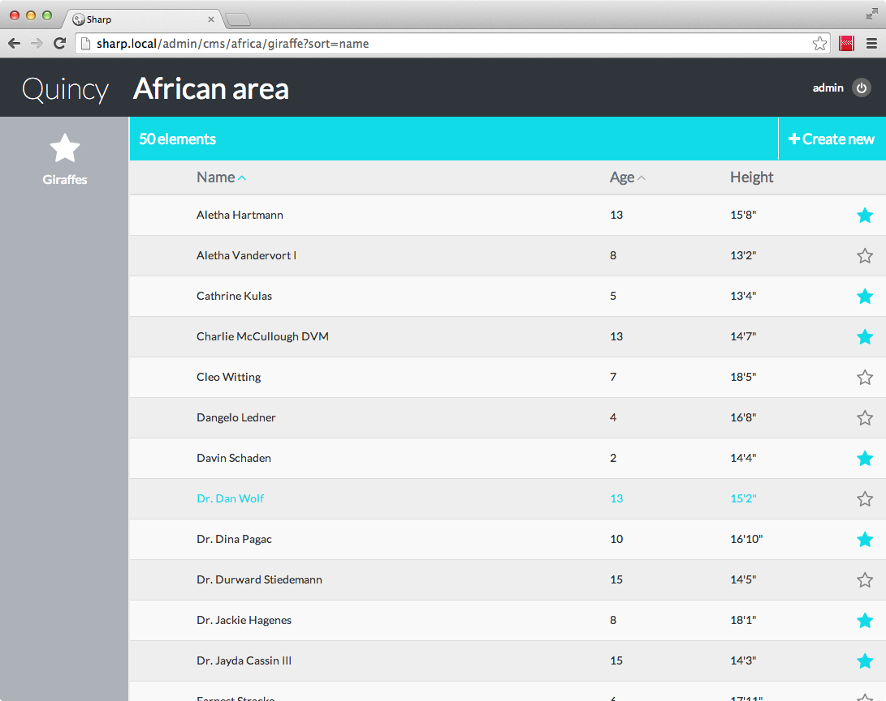

#Entities list

1. Sorting
1. Columns renderers
1. Activation
1. Reordering
1. Pagination
1. Search

OK, let's work on the giraffe list; but first, we need some data to work with. After a [faker](https://github.com/fzaninotto/Faker)-based seed, we not have 50 animals:



##1. Sorting

First thing we can notice: sorting doesn't work. We have to update our repo for that. Hopefully, it's easy:

```
function listAll(SharpEntitiesListParams $params)
{
	$giraffes = Giraffe::with('zookeeper');

	if($params->getSortedColumn())
	{
		$giraffes->orderBy($params->getSortedColumn(), $params->getSortedDirection());
	}

	return $giraffes->get();
}
```

Line by line, I first chose to eager load zookeeper (because I want to add its name on a column of the list, later). Then I make use of the SharpEntitiesListParams parameter, which contains (among other things) the sorted column and sorted direction. And I can now use he column sorting!


##2. Columns renderers

I'm not happy with the height column: data is expressed in cm, and I could like to have it in ft / inch. We can use a column renderer for that, which allows to format the displayed data.

First, we update the config file, adding a renderer attribute ton the column:

```
(...)
"list_template" => [
	"columns" => [
		(...)
		"height" => [
			"header"   => "Height",
			"width" => 2,
			"renderer" => '\Quincy\Sharp\Giraffe\HeightColumnsRenderer'
		]
	]
(...)
```

Then, the renderer class creation:

```
<?php namespace Quincy\Sharp\Giraffe;

use Dvlpp\Sharp\ListView\Renderers\SharpRenderer;

class HeightColumnsRenderer implements SharpRenderer {

	function render($instance, $key, $options)
	{
		$heightInCm = $instance->height;
		return $this->cmToInches($heightInCm);
	}

	private function cmToInches($heightInCm)
	{
		$inches = ceil($heightInCm/2.54);
		$feet = floor(($inches/12));
		return $feet."'".($inches%12).'"';
	}
} 
```

And here we go:



### Built-in renderers

Sharp has some built-in renderers, for common tasks:
- thumbnail:{width}x{height}
- charlimit:{count}
- markdownWordlimit:{count}
- date:{format}, where format is a valid `strftime` formatter
- nl2br

They can be used like this:

```
"renderer" => "charlimit:200"
"renderer" => "thumbnail:200x100"
```


##3. Activation / Deactivation

Notice the blue or outlined star at the end of each row? This is the active state indicator (we talk about it in the [Config](docs/config.md) page). The idea is to provide a basic way to declare an instance online or offline. We defined it this way in the config:

`"active_state_field" => "alive"`

This means that Sharp will look for an `alive` attribute for each Giraffe (literally accessing `$giraffe->alive`), and display the state indicator in blue (true) or outlined (false).

Of course, the idea is to allow activation and deactivation by clicking this button. For that, we need to have our repository implement the `Dvlpp\Sharp\Repositories\SharpHasActivateState` interface, which leads us to write two more methods:

```
function activate($id)
{
	$giraffe = $this->find($id);
	$giraffe->alive = true;
	$giraffe->save();
}

function deactivate($id)
{
	$giraffe = $this->find($id);
	$giraffe->alive = false;
	$giraffe->save();
}
```

We can now clic on the activate / deactivate star buttons, it's working.