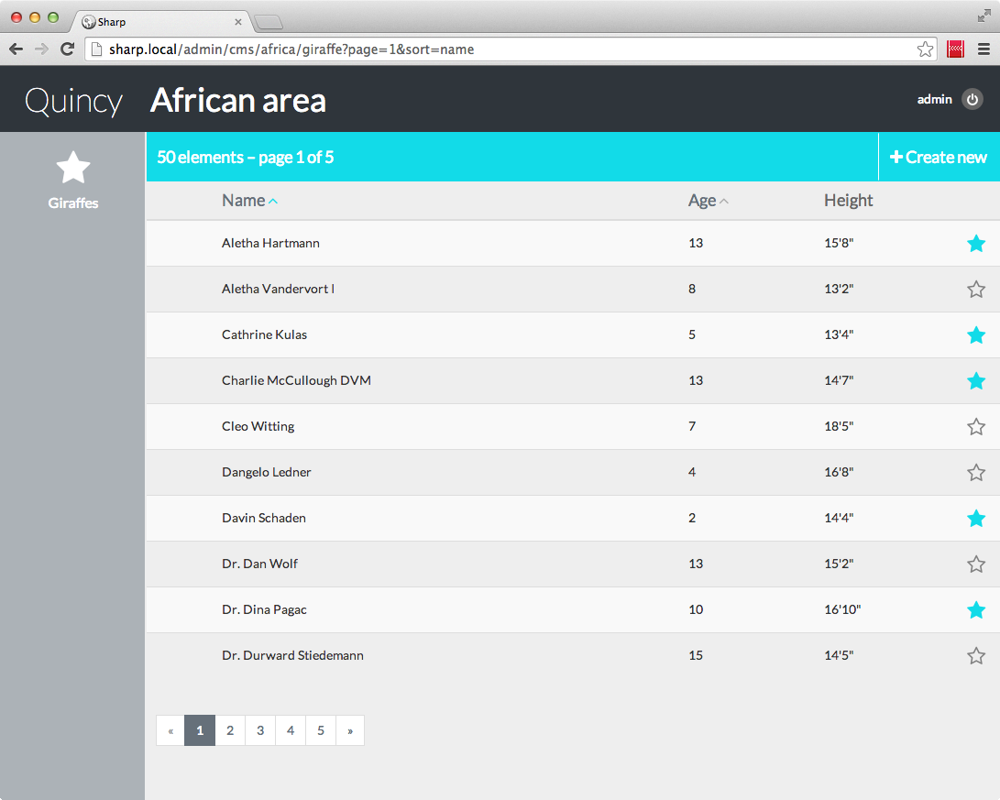
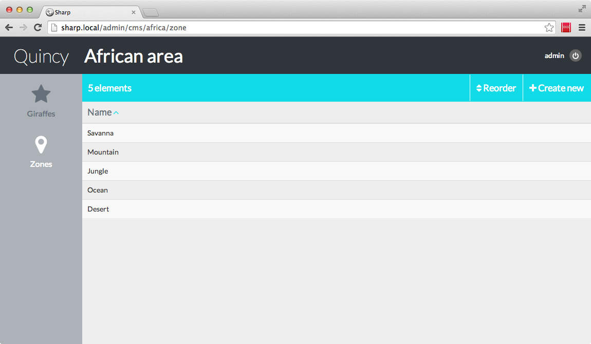
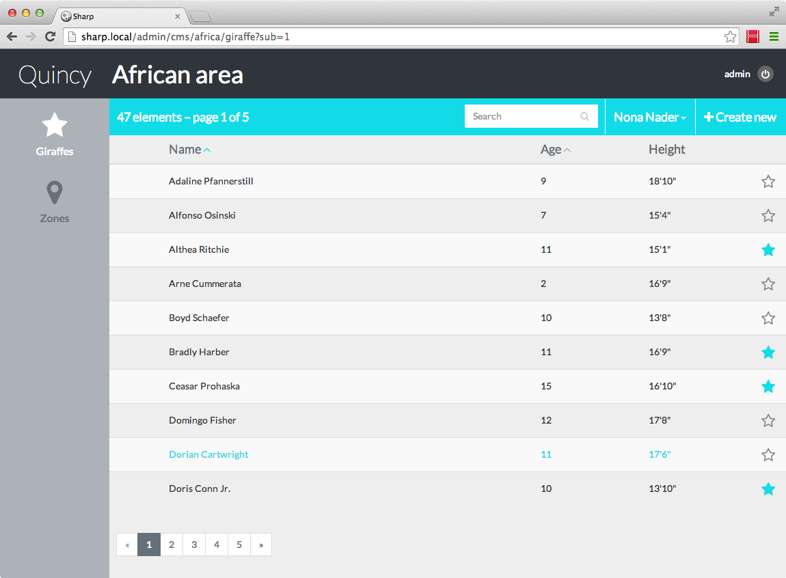

#Entities list

1. The entities list config
1. Sorting
1. Columns renderers
1. Activation
1. Pagination
1. Search
2. Reordering
2. Sublists

##1. The entities list config

All that we need here is store under the `list_template` attribute in the config:

```
(...)
"list_template" => [
	"columns" => [
		"picture" => [
			"width" => 1,
			"renderer" => 'thumbnail:100x100'
		],
		"name" => [
			"header"   => "Name",
			"sortable" => true,
			"width" => 7
		],
		"age" => [
			"header"   => "Age",
			"sortable" => true,
			"width" => 2
		],
		"height" => [
			"header"   => "Height",
			"width" => 2
		]
	],

	"paginate" => false,
	"reorderable" => false,
	"sublist" => false,
	"searchable" => false
]
(...)
```

All that stuff will be covered in this chapter. Let's just be global here:

- first we define columns of the list. Notice that the key of each column (`picture`, `name`, `age` and `height`) is an attribute of our giraffe object: that's the default, and it's necessary unless you provide a column renderer (see below), to allow Sharp to grab the value. For each, we indicate :
	- a column `header` value: pretty obvious.
	- optional `sortable` and `renderer` attribute: we'll get to that below.
	- a `width`: this is expressed in the Twitter Bootstrap way... Lets just say you have 12 units to allocate.
- then we have 4 optional parameters: in fact, they are all set to false, so we can get rid of them, but as you can imagine we're going to change those values.

OK, let's see:

##2. Sorting

OK, let's work on the giraffe list; but first, we need some data to work with. After a [faker](https://github.com/fzaninotto/Faker)-based seed, we not have 50 animals:


First thing we can notice: sorting doesn't work. We have to update our repo for that. Hopefully, it's easy:

```
function listAll(SharpEntitiesListParams $params)
{
	$giraffes = Giraffe::with('zookeeper');

	if($params->getSortedColumn())
	{
		$giraffes->orderBy($params->getSortedColumn(), $params->getSortedDirection());
	}

	return $giraffes->get();
}
```

Line by line, I first chose to eager load zookeeper (because I want to add its name on a column of the list, later). Then I make use of the SharpEntitiesListParams parameter, which contains (among other things) the sorted column and sorted direction. And I can now use he column sorting!


##3. Columns renderers

I'm not happy with the height column: data is expressed in cm, and I could like to have it in ft / inch. We can use a column renderer for that, which allows to format the displayed data.

First, we update the config file, adding a renderer attribute ton the column:

```
(...)
"list_template" => [
	"columns" => [
		(...)
		"height" => [
			"header"   => "Height",
			"width" => 2,
			"renderer" => '\Quincy\Sharp\Giraffe\HeightColumnsRenderer'
		]
	]
(...)
```

Then, the renderer class creation:

```
<?php namespace Quincy\Sharp\Giraffe;

use Dvlpp\Sharp\ListView\Renderers\SharpRenderer;

class HeightColumnsRenderer implements SharpRenderer {

	function render($instance, $key, $options)
	{
		$heightInCm = $instance->height;
		return $this->cmToInches($heightInCm);
	}

	private function cmToInches($heightInCm)
	{
		$inches = ceil($heightInCm/2.54);
		$feet = floor(($inches/12));
		return $feet."'".($inches%12).'"';
	}
} 
```

And here we go:


Now that we have a custom renderer to handle this column, notice we can give any key name for it in the config. This can be important in cases we want the same attribute in 2 columns (think of a date and a time for instance), or when we have an aggregate column.

Columns renderers can be used for many things: from visual or data formatting to maybe metrics calculation.

### Built-in renderers

Sharp has some built-in renderers, for common tasks:
- thumbnail:{width}x{height}
- charlimit:{count}
- markdownWordlimit:{count}
- date:{format}, where format is a valid `strftime` formatter
- nl2br

They can be used like this:

```
"renderer" => "charlimit:200"
"renderer" => "thumbnail:200x100"
```


##4. Activation / Deactivation

Notice the blue or outlined star at the end of each row? This is the active state indicator (we talk about it in the [Config](docs/config.md) page). The idea is to provide a basic way to declare an instance online or offline. We defined it this way in the config:

`"active_state_field" => "alive"`

This means that Sharp will look for an `alive` attribute for each Giraffe (literally accessing `$giraffe->alive`), and display the state indicator in blue (true) or outlined (false).

Of course, the idea is to allow activation and deactivation by clicking this button. For that, we need to have our repository implement the `Dvlpp\Sharp\Repositories\SharpHasActivateState` interface, which leads us to write two more methods:

```
function activate($id)
{
	$giraffe = $this->find($id);
	$giraffe->alive = true;
	$giraffe->save();
}

function deactivate($id)
{
	$giraffe = $this->find($id);
	$giraffe->alive = false;
	$giraffe->save();
}
```

We can now clic on the activate / deactivate star buttons.


##5. Pagination

In many cases we'll need pagination in entities lists. It's very easy to tackle with Sharp. First, as usual, the config:

```
(...)
"list_template" => [
	"columns" => [
		(...)
	],

	"paginate" => 10
	(...)
]
(...)
```

Only one parameter to configure: set a page count in the paginate attribute. Then, instead of `listAll()`, we need to implement the `paginate()` method in our repo. It's one or the other, so since we activate pagination now we can ignore `listAll()`:

```
function listAll(SharpEntitiesListParams $params)
{
	throw new BadMethodCallException("Not implemented");
}

function paginate($count, SharpEntitiesListParams $params)
{
	$giraffes = Giraffe::with('zookeeper');

	if($params->getSortedColumn())
	{
		$giraffes->orderBy($params->getSortedColumn(), $params->getSortedDirection());
	}

	return $giraffes->paginate($count);
}
```

We use here Laravel Eloquent paginate method, which is very convenient. Sharp expect to find an instance of \Illuminate\Pagination\Paginator (see [Laravel doc](http://laravel.com/docs/pagination)).

The fact is giraffe are now paginated:



##6. Search

The idea is to add a quick search functionality. So, in the config, we activate the search:

```
(...)
"list_template" => [
	"columns" => [
		(...)
	],

	"searchable" => true
	(...)
]
(...)
```

And we update our `paginate()` (or `listAll()`) method in the repo:

```
function paginate($count, SharpEntitiesListParams $params)
{
	$giraffes = Giraffe::with('zookeeper');

	if($params->getSearch())
	{
		foreach($params->getSearchTerms() as $term)
		{
			$giraffes->where(function ($query) use($term) {
				$query->orWhere("name", "like", $term)
					->orWhere("desc", "like", $term);
			});
		}
	}

	if($params->getSortedColumn())
	{
		$giraffes->orderBy($params->getSortedColumn(), $params->getSortedDirection());
	}

	return $giraffes->paginate($count);
}
```

One again, the philosophy is that we can implement this search in many ways, depending on the project: Sharp won't care, he just want the data back. So here, very simple, we perform a "or" search on `name` and `desc`. 

Notice we iterate over a `$params->getSearchTerms()` collection first, to search for all words. Notice also that we don't add the necessary '%' characters around `$term`: it's a default. To override this, simply provide prefix and suffix to the method: `$params->getSearchTerms($prefix, $suffix)`.


##7. Reordering

OK, I think we are going to need another entity to work with. We have Giraffe and Zookeeper (this one will be used in the next paragraph). To keep it simple, let's say our zoo areas are divided in *zones*, like savanna, mountains, and so on. We just have to create an entity config for those zones, a model, and a repo. Then insert some data, and:



OK, nothing fancy, a zone has only a name and an order attribute (yes. This is about order, so...).

Notice there's a "Reorder" button next to the "Create new", it's because of the config, as always:

```
(...)
"list_template" => [
	"columns" => [
		(...)
	],

	"reorderable" => true
	(...)
]
(...)
```

Right now this won't work. We have to implements the `reorder()` method of our zone repository:

```
function reorder(Array $entitiesIds)
{
	$k = 1;
	foreach($entitiesIds as $id)
	{
		Zone::where("id", $id)->update(["ordre"=>$k++]);
	}
}
```

And now, we can clic on the reorder button, drag and drop zones and validate to the DB.


Notice that I choose for this tutorial to manage order with an integer attribute, which is a brutal way to do it. But Sharp doesn't need you to do it this way: depending on the project or the entity, you can use integer, or some previous / next pointer, or anything else.


##8. Sublists

Like I said before, sublists are a transversal way to group entities. I gave a good season and theatre example in the [concepts](docs/concepts.md) page, but in our case let's say we want to group giraffes (and other animals) by zookeepers.

So first thing: config.

```
(...)
"list_template" => [
	"columns" => [
		(...)
	],

	"sublist" => true
	(...)
]
(...)
```

Now out giraffe repository must implements a new interface: `Dvlpp\Sharp\Repositories\SharpHasSublist`, and define 3 new methods:

```
function initCurrentSublistId($sublist)
{
	$this->currentZookeeperId = $sublist;
}

function getCurrentSublistId()
{
	if(!$this->currentZookeeperId)
	{
		$this->currentZookeeperId = Zookeeper::orderBy("name", "asc")->first()->id;
	}

	return $this->currentZookeeperId;
}

function getSublists()
{
	$zookeepers = Zookeeper::orderBy("name", "ASC")->get();
	$tab = [];
	foreach($zookeepers as $zk) $tab[$zk->id] = $zk->name;

	return $tab;
}
```

As always, and maybe especially here, there's many way to tackle this. The goal is to provide:

- a method to grab all the zookeepers in a id->name array: `getSublists()`
- a method to set the currently selected zookeeper:  `initCurrentSublistId()`
- and finally a method to get the current zookeeper, with a default: `getCurrentSublistId()`.

Here we use a simple class attribute to store this data, but it can come from a session value / cookie, or a database. And of course, this code can be mutualized: imagine we need the same sublist in other entities (which is very likely the case), we can easily put this code to a super class, or even better in a Trait.

To continue, we must also update our `listAll()` or `paginate()` method, to insert the current zookeeper in the request:

```
function paginate($count, SharpEntitiesListParams $params)
{
	$giraffes = Giraffe::with('zookeeper')
		->where("zookeeper_id", $this->getCurrentSublistId());
	(...)

	return $giraffes->paginate($count);
}
```

And this is it. For the purpose of the demo, I generate 150 giraffes, and 3 zookeepers. Here's the 47 giraffes kept by "Nona Nader" (sublist can be changed next to the search field):

