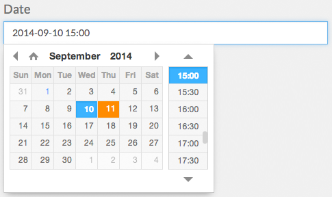
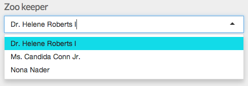
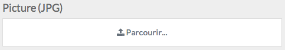
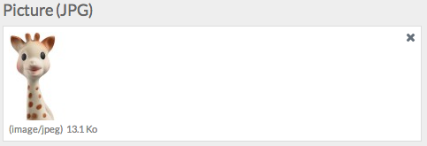
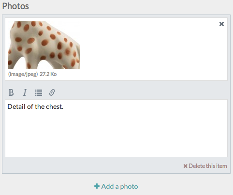
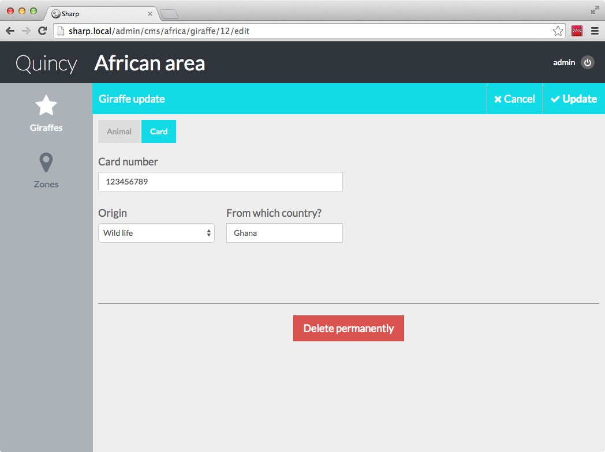

#Entity form

1. [Fields](#fields)
	2. [Shared config](#f-shared)
	3. [Text field](#f-text)
	4. [Textarea](#f-textarea)
	5. [Markdown textarea](#f-markdown)
	6. [Date](#f-date)
	7. [Check](#f-check)
	8. [Choose (dropdown)](#f-choose)
	9. [Hidden](#f-hidden)
	10. [Label](#f-label)
	11. [Password](#f-password)
	12. [Reference field](#f-ref)
	13. [File upload](#f-file)
	14. [List](#f-list)
	15. [List item reference field](#f-listitemref)
	16. [Tags field](#f-tags)
18. [The form layout](#form-layout)
17. [Conditional display (hide and show fields)](#conditional)
18. [Update and create](#f-update)
19. [Form validation](#f-validation)
20. [Single relation case (the tilde)](#singlerelation)

OK, here we are: we created some [entities config file(s)](config.md), and wrote [the base classes](entities_list.md) to handle lists display, reordering, searching and stuff. Now, let's tackle the big part, the actual data entry. This is in fact the final purpose of Sharp: provide a simple way to enter complex data without having to develop big javascript objects each time.

##<a name="fields"></a> 1. Fields

There's a bunch of them. 

###<a name="f-shared"></a> 1.1 Shared config

Here is the basic config shared by all fields:

```
"key" => [
	"label" => string,
*	"type" => string,
	"attributes" => [
		keys-values array
	],
	"field_width" => number
]
```

*__Important__: In this document, mandatory fields are marked with a star a the beginning of the line.*

- **label**: obviously, that's the field label...
- **type**: field type, one of those listed in this doc
- **attributes**: keys-values array of attributes which should be added to the actual field (placeholder, for instance).
- **field_width**: like for columns width in the entities list config, this is a width expressed in integer from 1 to 12 (full row). Default is 12.

And finally, about the **key**: this must be an instance attribute of the object, because Sharp will get values for form population ou repopulation from there. Using Eloquent, this must correspond to a database field.


###<a name="f-text"></a> 1.2 Text field

Just a simple regular text field. Base config:

```
"name" => [
	"label" => "Name",
*	"type" => "text"
]
```


###<a name="f-textarea"></a> 1.3 Textarea

Just a textarea field.

```
"desc" => [
	"label" => "desc",
*	"type" => "textarea",
	"height" => 200
]
```

- **height**: textarea height expressed in pixels 


###<a name="f-markdown"></a> 1.4 Markdown textarea

This will generate a markdown-specific textarea field, based on the [lepture/Editor](https://github.com/lepture/editor) javascript editor.

```
"desc" => [
	"label" => "Description",
*	"type" => "markdown",
	"toolbar" => "BI QU LP F",
	"height" => 200
]
```

- **height**: textarea height expressed in pixels 
- **toolbar**: clickable toolbar presented above the component. Spaces are separator, and each letter is one tool:
	- B: bold
	- I: italic
	- Q: quote
	- U: unordered list
	- O: ordered list
	- L: insert link
	- G: insert image
	- P: preview
	- F: toggle fullscreen


###<a name="f-date"></a> 1.5 Date

Useful to enter date and time:

```
"buy_date" => [
	"label" => "Date",
*	"type" => "date",
	"has_time" => true,
	"format" => "d/m/Y H:i",
	"step_time" => 30,
	"min_date" => "2014/01/01",
	"max_date" => "2014/12/31",
	"min_time" => "10:00",
	"max_time" => "18:00",
	"start_on_sunday" => true
]
```

- **format**: date format (valid pattern for PHP date function)
- **has_time**: display or not time selector
- **step_time**: in minutes, steps of time selector
- **min_date**, **max_date**: limit date range. Note: this will only affect the selector, but user can still enter an out-of-range date. Double check with validation for those cases. Special dynamic values :
	- '0' for today
	- '+1970/01/02' for tomorrow, '+1970/01/03' for the day after tomorrow, ...
	- '-1970/01/02' for yesterday, '-1970/01/03' for the day before yesterday, ...
- **start_date**: dynamic values of min/max_date applies
- **min_time**, **max_time**: limit time range (same restriction as min/max_date applies)
- **start_on_sunday**: starts week on sunday.

The date component is based on the [datetimepicker Jquery plugin](http://xdsoft.net/jqplugins/datetimepicker/). For i18n, the global app locale applies.




###<a name="f-check"></a> 1.6 Check

A simple checkbox.

```
"is_great" => [
*	"type" => "check",
*	"text" => "Is this person great?",
	"checked" => false
]
```

- **text**: the checkbox text (clickable)
- **checked**: set to true if the checkbox needs to be checked by default

Note: Usually, you wouldn't put a label attribute for a checkbox.

Sharp always send the value of a checkbox attribute, even if unchecked.


###<a name="f-choose"></a> 1.7 Choose

A select element (also called dropdown).

```
"color" => [
	"label" => "Color",
*	"type" => "choose",
*	"values" => [
		'#ff0000' => "Red",
		'#00ff00' => "Green",
		'#0000ff' => "Blue",
		'#ffffff' => "White",
]
```

- **values**: keys-values array for picking list

This component is rendered by the [selectize.js](http://brianreavis.github.io/selectize.js/) plugin.


###<a name="f-hidden"></a> 1.8 Hidden

Well, you know. Yes, an hidden field.

```
"age" => [
*	"type" => "hidden"
]
```

Note that there isn't any *value* attribute: like for all other fields, the field is populated with instance->age (in this example).


###<a name="f-label"></a> 1.9 Label

Label is for displaying read-only data.

```
"name_label" => [
*	"type" => "label",
*	"format" => "His name is {{name}}"
]
```

- **format**: the label text. It could be either static or dynamic: in this last case, [Mustache template](https://github.com/bobthecow/mustache.php) are accepted. We can even navigate across relationships with the standard dot notation. For example: `{{zookeeper.name}}`.

Nothing will be posted here, and the key for the field could be anything unique.


###<a name="f-password"></a> 1.10 Password

A password field.

```
"pwd" => [
*	"type" => "password"
]
```


###<a name="f-ref"></a> 1.11 Reference field

This one is used to reference a related instance, in a one-to-* relationship.

```
"zookeeper_id" => [
	"label" => "Zoo keeper",
*	"type" => "ref",
*	"repository" => '\Quincy\Sharp\Zookeeper\Repository',
	"create" => false
]
```

The form field *key* attribute usually refers to a foreign key.

- **repository**: the full class path of the repo in charge of creating the available list of instances. The method called is `formList($askingInstance)`, which has to be created:

```
function formList($askingInstance)
{
	$zookeepers = Zookeeper::orderBy("name", "ASC")->get();
	$tab = [];
	foreach($zookeepers as $zk) $tab[$zk->id] = $zk->name;
	return $tab;
}
```

This component is rendered by the [selectize.js](http://brianreavis.github.io/selectize.js/) plugin. 




###<a name="f-file"></a> 1.12 File upload

OK, file upload are basically the main reason I developed Sharp, at the beginning. You know, asynchronous upload, files types, tmp directory, storage, repopulation in case of validation problem, ...

Here's how Sharp is dealing with this issue:

```
"picture" => [
	"label" => "Picture (JPG)",
*	"type" => "file",
	"file_filter" => "jpg,jpeg",
	"file_filter_alert" => "JPG only",
	"thumbnail" => "200x100"
]
```

- *file_filter*: client side file extension validation
- *file_filter_alert*: the message shown when file extension is invalid
- *thumbnail*: obviously image only: the size of the thumbnail displayed.

Like all other fields, (re-)population is automatic. **But** there's two catches:

- new files are uploaded to a /tmp, in the public_path folder. This folder must exist.
- And more, let's say, annoying: Sharp has to know where files are stored in order to display thumbnails or file info. To do this, we have to let our models which manage files to implement a small interface:

```
<?php namespace Quincy\Sharp\Giraffe;

use Dvlpp\Sharp\Repositories\SharpModelWithFiles;

class Giraffe extends \Eloquent implements SharpModelWithFiles {

	(...)

	function getSharpFilePathFor($attribute)
	{
		if($attribute=="picture") return public_path("files/giraffes/".$this->picture);
	}
}
```

The `getSharpFilePathFor($attribute)` method is called when existing instances already have files, and must return the file path.

The rest is magic, provided on the client side by the well-known [blueimp/jQuery-File-Upload package](https://github.com/blueimp), and on the server side by the [intervention/image](http://image.intervention.io) package.






###<a name="f-list"></a> 1.13 List

I wrote that file upload was the reason why I developed Sharp: in fact, it's file upload *and lists*. In many projects, I have to handle lists with dynamic items, for all kind of purpose:

- pictures and legend collection
- command rows
- comments
- ...

A list is an ordered collection of items. An item is a group of fields. Here's how we can create a list in the config file:

```
"photos" => [
	"label" => "Photos",
*	"type" => "list",
	"sortable" => true,
	"addable" => true,
	"removable" => true,
	"add_button_text" => "Add a photo",
	"remove_button_text" => "Delete this item",
	"item_id_attribute" => "id",
*	"item" => [
		"file" => [
			"type"=>"file",
			"file_type"=>"jpg,jpeg,png,gif",
			"thumbnail"=>"0x100"
		],
		"legend" => [
			"type"=>"markdown",
			"height"=>120,
			"toolbar"=>"BIUL"
		]
	]
]
```

- **sortable**: define if user can re-arrange items (drag and drop)
- **addable**: define if user can add a new item
- **removable**: define if user can delete items
- **add_button_text**: text displayed on the add button
- **remove_button_text**: text displayed on the remove button
- **item_id_attribute**: if the id attribute of the item is not "id", provide it here.
- **item**: the actual item, which group fields. It can be any field except a list.

The posted value of a list is obviously a multidimensional array, built this way:

`list_name[item_id][field_name] = value`

So in our example: `photos[X][file]` and `photos[X][legend]` for each item, plus `photos[X][id]` which is generated (the "id" part could be replaced by the `item_id_attribute` config value). Remember how we build the photos relation in the Giraffe model:

```
function photos()
{
	return $this->morphMany('\Quincy\Sharp\Photo\Photo', 'animal');
}
```

We can ignore the morphMany specificity for now, it would be te same with a classic oneToMany. And again, Eloquent is leveraged here, but Sharp will just need a `photos` attribute which return a collection (an array is fine) of objects with attributes `id`, `file` and `legend`.

In case of an item creation, X would be a generated unique string, starting with "N_" (for instance : `N_137qsnpma`).




###<a name="f-listitemref"></a> 1.14 List item reference field

This one is for a quite rare case: to reference an specific item in a list of another entity instance. Suppose we develop a new Comment entity, and we want to attach it to a specific photo of our giraffe photos list described earlier: this is a list item reference (reference is toward a specific photo of a giraffe).

```
"giraffe_photo_id" => [
	"label" => "Photo",
*	"type" => "refSublistItem",
*	"linked_ref_field" => "giraffe_id",
*	"ref_list_id" => "photos",
*	"repository" => '\Quincy\Sharp\Giraffe\Repository'
]
```

- **linked_ref_field**: the key of the linked ref field responsible for the entity instance selection. In out comment case, we first need to select the related Giraffe, and then the photo which we want to comment. This means the form MUST declare a giraffe_id Reference field.
- **ref_list_id**: the key of the list of the referenced entity (photos, here).
- **repository**: the repo where the `formListForSublist($sublistId, $askingInstance)` method is defined (see below).

The giraffe repository, here, must declare a new method:

```
function formListForSublist($sublistId, $askingInstance)
 {
	$tab = [];

	if($sublistId == "photos")
	{
		$photos = Photo::where('animal_type', '\Quincy\Sharp\Giraffe\Giraffe')->get();
		foreach($photos as $photo)
		{
			$tab[$photo->animal_id][$photo->id] = Str::limit($photo->legend, 50);
		}
	}
	
	return $tab;
}
```

This method is responsible for creating a multidimensional array of giraffe x photos with a text value to display in a dropdown list. The user can now pick a giraffe, and then pick a specific photo.


###<a name="f-tags"></a> 1.15 Pivot tags field

It's pretty common to manage tags. There's different ways to do it, and Sharp proposal is to handle it with a tags table and a pivot table. 

Let's say we want to list the physical particularities of a giraffe. She could have several, or none; and we want to store all different characteristic somewhere (to perform search or filtering maybe). Well, we need a `particularities` table, and a `giraffes_particularities` pivot table.

With this structure, here's the Sharp config needed:

```
"particularities" => [
	"label" => "Physical particularities",
*	"type" => "pivot",
	"addable" => true,
*	"repository" => '\Quincy\Sharp\Particularities\Repository'
]
```

- **addable**: if true, a new tag can be created by the user. In this case, the text string is sent for the update.
- **repository**: the tag repo which has to define a formList($askingInstance) method, like for instance:

```
function formList($askingInstance)
{
	$particularities = Particularity::orderBy("name", "ASC")->get();
	$tab = [];
	foreach($particularities as $p) $tab[$p->id] = $p->name;

	return $tab;
}
```

The tag field is now complete. The rendering is done with the [selectize.js plugin](http://brianreavis.github.io/selectize.js/).


##<a name="form-layout"></a> 2. The form layout

Maybe you noticed that the config file contains a second form-related attribute. That's `form_layout`:

```
"form_layout" => [
	"tab1" => [
		"tab" => "",
		"col1" => [
			"name",
			"picture",
			"zookeeper_id",
			"age",
			"height",
			"particularities"
		],
		"col2" => [
			"desc",
			"photos"
		]
	],
	"tab2" => [
		"tab" => "Card",
		"col1" => [
			"card~number",
			"card~origin",
			"card~origin_zoo",
			"card~origin_country"
		],
		"col2" => []
	]
]
```

This config part indicate how to organize the form, by embedding the fields in tabs and cols. Let's dig in:

- first there's tabs. Keys are irrelevant ("tab1" here), they just need to be unique. You can define several tabs, and the result will be a form split in pages (see screenshot below). The "tab" attribute is meant to set the tab label: in a single tab case, you don't need it.
- then come columns: unlike tabs, you must always define 2 of them.

With the config above, here's the result:





##<a name="conditional"></a> 3. Conditional display (hide and show fields)

Sharp offers a simple way to hide or show fields depending on a Check or a Choose value. This is all done in the config file:

```
"is_married" => [
	"type" => "check",
	"text" => "Is married?",
	"checked" => false
],
"partner_id" => [
	"label" => "Partner",
	"type" => "ref",
	"conditional_display" => "is_married",
	"repository" => '\Quincy\Sharp\Giraffe\Repository'
],
"is_sterile" => [
	"type" => "check",
	"text" => "Is sterile?",
	"conditional_display" => "!is_married",
]
```

In this example, if `is_married` check is on the `partner_id` ref field is shown and the `is_sterile` check is hidden (defined with the "!" prefix); and if `is_married` is unchecked, well, I think you guessed.

This could be done with a Choose field too:

```
"origin" => [
	"label" => "Origin",
	"type" => "choose",
	"values" => [
		"0" => "Unknown",
		"zoo" => "Other Zoo",
		"wild" => "Wild life"
	]
],
"origin_zoo" => [
	"label" => "Which one?",
	"type" => "text",
	"conditional_display" => 'origin:zoo'
],
"origin_country" => [
	"label" => "From which country?",
	"type" => "text",
	"conditional_display" => 'origin:wild'
]
```

You can even indicate multiple matches, separated by a comma (Choose only):

```
"legend" => [
	"label" => "Legend",
	"type" => "text",
	"conditional_display" => 'type:photo,video'
]
```


##<a name="update"></a> 4. Update and create

This is the part where you have to do something in your repository with the posted data. Like, you know, save it in a database. And here, you have two big choices:

- if you use Eloquent, you can... well, let Sharp do everything. This important point is [fully explained here](auto_updater.md).
- Or you can handle it yourself. Here's a sample posted data from our Giraffe example:

```
[
	"name" => "Albert Olson",
	"picture" => "5406c04faa0ec.jpg",
	"__file__picture" => "/home/vagrant/sharp/public/tmp/5406c04faa0ec.jpg",
	"zookeeper_id" => "3",
	"age" => "10",
	"height" => "442",
	"particularities" => ['1','2','#single'],
	"desc" => "Labore assumenda tempore modi consequatur. Nemo omnis vitae voluptates illum occaecati assumenda. Et hic ut dolorem excepturi quia natus consectetur. Et dolorem dolorum eveniet quam rerum libero doloremque.",
	"photos" => [
		"1" => [
			"id" => "1"
			"file" => "5406c053d5661.jpg"
			"legend" => "chest."
		],
		"N_ojcu929v4" => [
			"id" => "N_ojcu929v4"
			"file" => "5406c05e21e60.jpg"
			"legend" => "Detail of the front face."
		]
	],
	"__file__photos" => [
		"1" => [
			"file" => "/home/vagrant/sharp/public/files/giraffes/5406c053d5661.jpg"
		],
		"N_ojcu929v4" => [
			"file"=> "/home/vagrant/sharp/public/tmp/5406c05e21e60.jpg"
		]
	]
]
```

The way to retrieve posted data is very simple for most of the fields: 

`$value = Input::get("attribute_name")`

For more complex fields, here's some details:

### 4.1 Date

```
'birth_date' => '2014-08-15 14:05:00',
'__date__birth_date' => '15/08/2014 14:05'
```

Two posted data:

- first one is the actual value, in classic DB format Y-m-d H:i:s
- the second one, prefixed by "\_\_date__", has the displayed format and is meant to be only used internally for repopulation.

### 4.2 List

```
'somelist' => [
	1 => [
		'id' => '1'
		'name' => 'first item'
	],      
	2 => [
		'id' => '2'
		'name' => 'second item'
	],
	'N_4mxq6pfge' => [
		'id' => 'N_4mxq6pfge'
		'name' => 'new item (3)'
	]
]
```

A List is posted as an array of items. Order of items matters: it respect the user desired order.

New items have a generated string id, starting with "N_".

### 4.3 File upload

```
'picture' => '5406d727d8dc8.jpg',
'__file__picture' => '/home/vagrant/sharp/public/tmp/5406d727d8dc8.jpg',
```

There's two posted data:

- the actual value, which is in this case a simple file name. If there's no file (like nothing set or file was deleted), this value is empty.
- a special one prefixed by "\_\_file__" which contains the full path to the file. This is meant to be used internally, for repopulation.

*Note that you can have any implementation for the storage of your uploads, but you have to be able to determine if the file was newly uploaded, based on its posted name.*


### 4.4 Check

Nothing special here, just a quick note to say that unchecked checkfields are posted (valued with a 0), unlike a standard POST form would do.


### 4.5 Pivot tags

Sharp's tags are managed with a pivot table (see field description above). So, posted data contains tag ids:

`'tags' => ['2', '5', '12']`

Very simple. But the "addable" option in the tag config file authorize to create new tags on-the-fly. In this case, the name is sent. For example, let's create the tag "New tag":

`'tags' => ['2', '5', '#New tag']`

The update code can differentiate new tags from existing one by checking numeric vs string values. Now why is there a # at the beginning of the name? To indicate that it's a new tag (we can't just rely on a "is_numeric" test, because a tag name could be numeric)... The # must be removed on the update stage.


##<a name="validation"></a> 5. Form validation

Naturally, Sharp can help when it comes to form validation. We can reference a *Validator* in the config:

```
(...)
"giraffe" => [
	(...)
	"validator" => '\Quincy\Sharp\Giraffe\Validator',
	(...)
]
(...)
```

And create the Validator class:

```
<?php namespace Quincy\Sharp\Giraffe;

use Dvlpp\Sharp\Validation\SharpValidator;

class Validator extends SharpValidator {

	public function getRules()
	{
		return [
			"name" => "required",
	            "picture" => "required",
	            "age" => "required|integer",
	            "height" => "integer"
		];
	}
} 
```

The rest is [Laravel-powered validation](http://laravel.com/docs/validation). Notice that Sharp is doing a hard job to ensure that all fields are repopulated after a validation error, including file upload or newly created list items.

You can easily set specific creation or update rules: override the `getUpdateRules()` and `getCreationRules()` of SharpValidator, respectively. For example, suppose we want to force the user to upload at least one photo in the list, but only in case of update:

```
public function getUpdateRules()
{
	return [
		"photos" => "array"
	];
}
```

Note that the Laravel standard "array" rule is a good way to test if a list is empty.

Finally, you can define your own error messages by overriding the `getMessage()` method. In our example, it may be nice to put:

```
public function getMessages()
{
	return [
		'photos.array' => 'Please provide at least one photo.',
	];
}
```

A final note: you can choose to override the class attributes instead of methods, if you prefer. Simply take a look to the `Dvlpp\Sharp\Validation\Validator` class.


##<a name="singlerelation"></a> 6. Single relation case

A final chapter on this long page, to talk about a quite specific case. Suppose that zoo animal could have an "ID card", with some info on it: a number and an origin. We decide to add a animal_card table, and a one-to-one relationship with the giraffe table (which contains now a animal_card_id).

In fact, this concern both One-to-one relations: foreign key could be either in the first entity table, or in the second. A more common example could be an address, which has its own table because it can be related to multiple entities. But let's keep our ID card example, because giraffes don't have addresses.

Question is: how can we provide a way to enter this card id info in the giraffe form? And answer is we can do it this way, in the `form_fields` config:

```
"card~number" => [
	"label" => "Card number",
	"type" => "text"
],
"card~origin" => [
	"label" => "Origin",
	"type" => "choose",
	"values" => [
		"0" => "Unknown",
		"zoo" => "Other Zoo",
		"wild" => "Wild life"
	] 
]
```

As you can see, the trick is to prefix the attributes by the relation name, with a [~](https://twitter.com/fideloper/status/478542189555748864) separator. This means in the Girafe model we must have:

```
public function card()
{
	return $this->belongsTo('\Quincy\Sharp\Animal\AnimalCard', 'animal_card_id');
}
```

With this config, fields should be populated just right. With a little more config and a tab displaying (described in the [form layout](#form-layout) chapter), here's what we can have right in the giraffe form:


And correctly managed by the [Sharp Eloquent Auto-updater](auto-updater.md), which is the topic of the next part.
 

